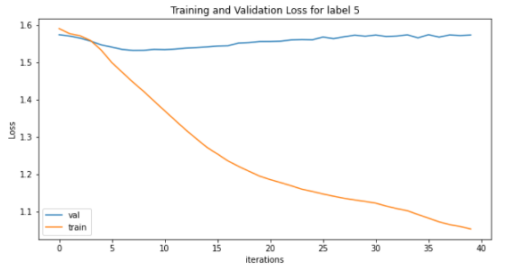
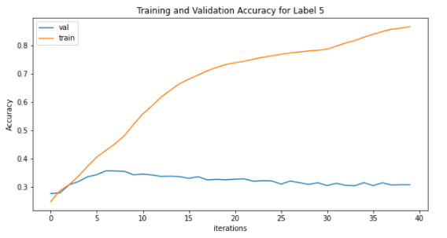
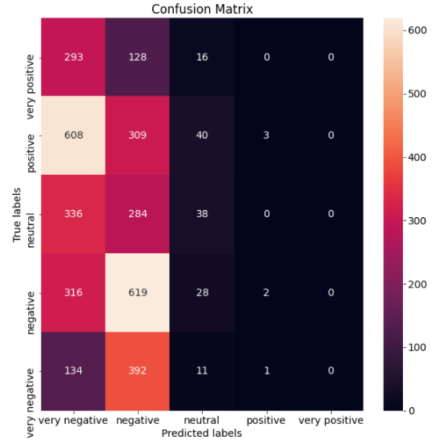
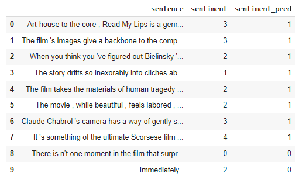

# Standford Sentiment Treebank


- [Objective & Data description](#objective--data-description)
- [Proposed Solution](#proposed-solution)
- [Model and Loss function](#model-and-loss-function)
- [Results: Accuracy, Loss](#results-accuracy-loss)
- [Further Improvements](#further-improvements)


## Objective & Data description
The Stanford Sentiment Treebank dataset  consists of 11,855 sentences extracted from movie reviews with fine-grained sentiment labels [0–4] (0 most negative and 4 most positive). It also consists of well as 215,154 phrases that compose each sentence in the dataset. We have used 3 files: _sentiment_labels_, _dictionary_ and _datasetSentences_. The movie reviews to classified into 5 classes do not have their sentiments directly linked. The _datasetSentences_ file contains those sentences and sentence ids for the respective sentences. The sentiment of each of these sentences exist in the file _sentiment_labels_ linked to the file _dictionary_ using _phrase ids_. In this dataset, sentence ids and phrase ids are different from each other. Hence, to get a proper sentiment label for the movie reviews in the datasetSentences, we merge these three files with each other and assign sentiment labels into 5 classes basis: [most negative](0-0.2, 0.2-0.4, 0.4-0.6, 0.6-0.8, 0.8-1.0) [most positive].

## Proposed Solution
Eventhough we have 11,855 sentences (train- 8297 and valid- 3558 sentences), still we augment the data using multiple augmentation techniques to increase our data-size to train our models better. For the model, we use a multi-layer LSTM model fed by an embedding layer. To classify the sentences into their perceived sentiment labels from the LSTM layer, we use two fully connected layers with output dimension equal to both the sentiments' labels present in the dataset. 


## Model and Loss function
As discussed in proposed architecture, we use a model with embedding (300), 4 LSTM and 2 fully connected layers.  First we pass our augmented and original dataset through _spacy_ to tokenize it. We tokenize the training, validation and testing daya individually as our dataset is already split into train-valid-test hence we teh same split to create the bucketiterators. Using train dataset we created a vocabulary.

We use _Adam_ optimiser with a learning rate of 1*10^-4 and _CrossEntropyLoss_ 


Cross entropy loss is used since  it is a multi-class classification problem.
This model was trained for 40 epochs. 
```
Epoch 1 | Time Taken: 2.52s
	Train Loss  5 labels: 1.591 | Train Acc  5 labels: 24.96%
	 Val. Loss  5 labels: 1.574 |  Val. Acc  5 labels: 27.73% 

Epoch 2 | Time Taken: 2.41s
	Train Loss  5 labels: 1.577 | Train Acc  5 labels: 28.79%
	 Val. Loss  5 labels: 1.571 |  Val. Acc  5 labels: 27.98% 

Epoch 3 | Time Taken: 2.40s
	Train Loss  5 labels: 1.572 | Train Acc  5 labels: 30.86%
	 Val. Loss  5 labels: 1.565 |  Val. Acc  5 labels: 30.83% 
.....	 
.....	 
.....
Epoch 38 | Time Taken: 2.34s
	Train Loss  5 labels: 1.066 | Train Acc  5 labels: 85.65%
	 Val. Loss  5 labels: 1.574 |  Val. Acc  5 labels: 30.74% 

Epoch 39 | Time Taken: 2.36s
	Train Loss  5 labels: 1.061 | Train Acc  5 labels: 86.01%
	 Val. Loss  5 labels: 1.572 |  Val. Acc  5 labels: 30.86% 

Epoch 40 | Time Taken: 2.35s
	Train Loss  5 labels: 1.054 | Train Acc  5 labels: 86.57%
	 Val. Loss  5 labels: 1.574 |  Val. Acc  5 labels: 30.85%
	 
```
As we can see, the model for sentiment [0-4] starts from 27.73% validation accuracy and 1.574 validation loss which by 40th epoch is:  Val. Loss: 1.574 |  Val. Acc: 30.85%


## Results: Accuracy, Loss
Post training our model for sentiments' labels [0-4], we get a training accuracy of 86.57% and a validation accuracy of 30.85%

The training and validation loss the model for sentiments (for sentiments on scale 0-4):



The training and validation accuracy the model for sentiment (for sentiments on scale 0-4):



Confusion Matrix:





Sample outputs from the test data:



Here are 10 examples from the output of the model prediction. The rest can be checked from the colab notebook.

## Further Improvements

- As we saw in the confusion matrix, our model makes most classification mistakes in the positive classes. Hence, special notice and augmentation for the positive classes may help in lifting the score
- We only use an simple LSTM model here. More sophisticated models can be used for better prediction
- We see this as a case of overfitting as the validation accuracy keeps decreasing futher from the increasing train accuracy
- This time we did did it only for 5 classes. Training can also be extended to 1-25 classes to see any performance changes
- Since teh sentinments provided in the actual data are on a continuous scale, we can create this into a regression problem post letting features out of the LSTM model and prdict on a continuous scale
- Add callbacks to the code to get the best valid accuracy and stop training when required accuracy is reached
- Better hyperparameter optimisation using Bayesian optimisation techniques, et all.


## Group

- Anirban Mukherjee
- Debasish Sarangi


