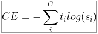
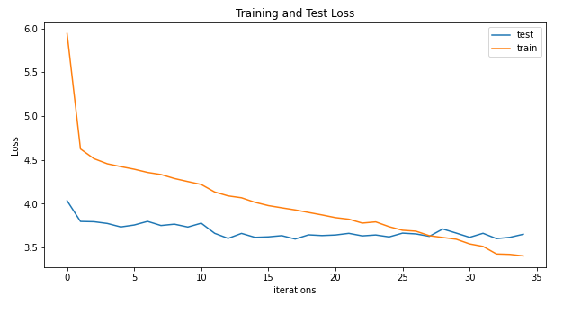
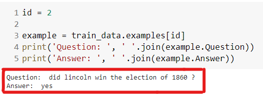

# CMU Question/Answer dataset


- [Objective & Data description](#objective--data-description)
- [Proposed Solution](#proposed-solution)
- [Model and Loss function](#model-and-loss-function)
- [Results: Accuracy, Loss](#results-accuracy-loss)
- [Group](#group)

## Objective & Data description
There are three directories, one for each year of students: S08, S09, and S10. The file "question_answer_pairs.txt" contains the questions and answers. The first line of the file contains column names for the tab-separated data fields in the file. This first line follows:

- **ArticleTitle** is the name of the Wikipedia article from which questions and answers initially came.
- **Question** is the question.
- **Answer** is the answer.
- **DifficultyFromQuestioner** is the prescribed difficulty rating for the question as given to the question-writer. 
- **DifficultyFromAnswerer** is a difficulty rating assigned by the individual who evaluated and answered the question, 
which may differ from the difficulty in field 4.
- **ArticleFile** is the relative path to the prefix of the article files. html files (.htm) and cleaned 
text (.txt) files are provided.

## Proposed Solution
We have used a sequence to sequence encoder-decoder model with multiple LSTM layers in each of encoder and decoder.


## Model and Loss function
 Our model has a 2-layered LSTM that serves as our encoder and another 2-layered LSTM that has been used inside the decoder.We have used encoding and decoding embedding dimension of 256. We are taking 512 as our hidden dimensions. 
First we pass dataset through _spacy_ to tokenize it. We tokenize the training and testing data individually as our dataset is already split into train-valid-test hence we teh same split to create the bucketiterators. Using train dataset we created a vocabulary.

We use _Adam_ optimiser with a learning rate of 5e-4 and _CrossEntropyLoss_ 



Cross entropy loss is used since  it is a multi-class classification problem.
This model was trained for 35 epochs. 
```
Epoch: 01 | Time: 0m 2s
	Train Loss: 5.940 | Train PPL: 379.996
	 Test. Loss: 4.034 |  Test. PPL:  56.491
Epoch: 02 | Time: 0m 1s
	Train Loss: 4.624 | Train PPL: 101.897
	 Test. Loss: 3.797 |  Test. PPL:  44.575
Epoch: 03 | Time: 0m 1s
	Train Loss: 4.514 | Train PPL:  91.253
	 Test. Loss: 3.794 |  Test. PPL:  44.428
.....	 
.....	 
.....
Epoch: 33 | Time: 0m 1s
	Train Loss: 3.426 | Train PPL:  30.747
	 Test. Loss: 3.601 |  Test. PPL:  36.635
Epoch: 34 | Time: 0m 1s
	Train Loss: 3.421 | Train PPL:  30.605
	 Test. Loss: 3.616 |  Test. PPL:  37.181
Epoch: 35 | Time: 0m 1s
	Train Loss: 3.403 | Train PPL:  30.068
	 Test. Loss: 3.651 |  Test. PPL:  38.507
```
As we can see, the model starts from 4.034 test loss and 5.940 train loss which by 35th epoch is:  Test. Loss: 3.651 |  Train Loss: 3.403


## Results: Perplexity, Loss


The training and validation loss the model:




Sample outputs from the test data:




## Group

- Anirban Mukherjee
- Debasish Sarangi


