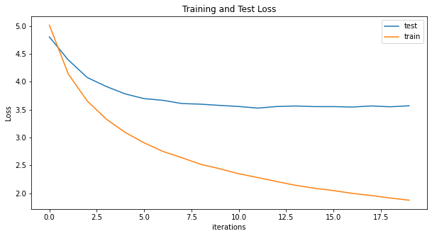
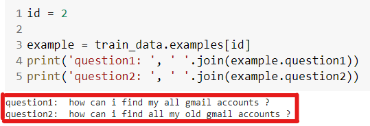

# Quora duplicate questions dataset


- [Proposed Solution](#proposed-solution)
- [Model and Loss function](#model-and-loss-function)
- [Results: Accuracy, Loss](#results-accuracy-loss)
- [Group](#group)


## Proposed Solution
We have used a sequence to sequence encoder-decoder model with multiple LSTM layers in each of encoder and decoder.


## Model and Loss function
 Our model has a 2-layered LSTM that serves as our encoder and another 2-layered LSTM that has been used inside the decoder.We have used encoding and decoding embedding dimension of 256. We are taking 512 as our hidden dimensions. 
First we pass dataset through _spacy_ to tokenize it. We tokenize the training and testing data individually as our dataset is already split into train-valid-test hence we teh same split to create the bucketiterators. Using train dataset we created a vocabulary.

We use _Adam_ optimiser with a learning rate of 5e-4 and _CrossEntropyLoss_ 


Cross entropy loss is used since  it is a multi-class classification problem.
This model was trained for 35 epochs. 
```
Epoch: 01 | Time: 7m 26s
	Train Loss: 5.010 | Train PPL: 149.934
	 Test. Loss: 4.784 |  Test. PPL: 119.636
Epoch: 02 | Time: 7m 27s
	Train Loss: 4.135 | Train PPL:  62.511
	 Test. Loss: 4.358 |  Test. PPL:  78.064
Epoch: 03 | Time: 7m 29s
	Train Loss: 3.653 | Train PPL:  38.581
	 Test. Loss: 4.074 |  Test. PPL:  58.791
.....	 
.....	 
.....
Epoch: 18 | Time: 7m 28s
	Train Loss: 1.950 | Train PPL:   7.028
	 Test. Loss: 3.572 |  Test. PPL:  35.584
Epoch: 19 | Time: 7m 23s
	Train Loss: 1.908 | Train PPL:   6.737
	 Test. Loss: 3.560 |  Test. PPL:  35.177
Epoch: 20 | Time: 7m 23s
	Train Loss: 1.869 | Train PPL:   6.484
	 Test. Loss: 3.568 |  Test. PPL:  35.433
```
As we can see, the model starts from 4.784 test loss and  5.010 train loss which by 35th epoch is:  Test. Loss: 3.568 |  Train Loss: 1.869


## Results: Perplexity, Loss


The training and validation loss the model:




Sample outputs from the test data:




## Group

- Anirban Mukherjee
- Debasish Sarangi


